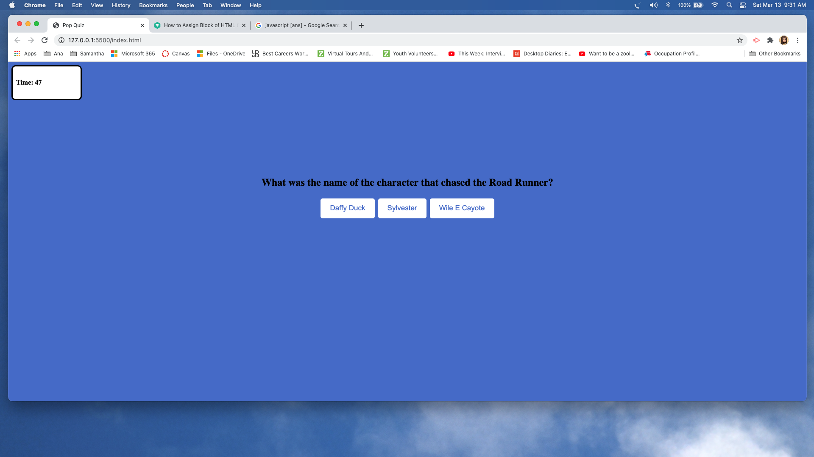

# Quiz Project

## Descriptiion

The short quiz is intended to test your knowledge on Looney Toons Cartoons.  It is just for fun so that I may try out some of the JavaScript tough during class and includes attempts at: declaration of global variables, object variables with several parameters for thequestions, functions with if else. I am also inclued variables with HTML block. functions for the time (which I don't believe I understand very well) and for loops. Enjoy. 

## Installation

No installation is needed other than prefered browers and a keyboard to enter criteria.

- Open the browser to the following link:     https://al-moreno.github.io/Password-Homework/
- Click the start button and begin the test.
- At the end of the text you will be provided with your score.

## Usage

The coding on this application would be helpful (once all issue are fixed) with testing for verification that students understand material tough or to test job skills.

You may open my code for review with VSCode by accessing the following links.

https://github.com/al-moreno/quiz

https://al-moreno.github.io/quiz/

## This repo containes:
- A ReadMe.md file
- Index.html file
- style.css file
- script.js file
- images 

## Credits

The follwoig idividuals and / or sites contributed and/or collaborated with the code:

- for the HTML block in the JavaScript file:    https://www.tutorialrepublic.com/faq/how-to-assign-block-of-html-code-to-a-javascript-variable.php

- for the idea of the CSS and some of the time: https://www.youtube.com/watch?v=pQr4O1OITJo

- and the rest was thanks to my amazing instructor Rachel. 

## License
Uncertain of required licence so to CMA I am leaving the one pertaining to Trilogy Education Services.

---

© 2021 Trilogy Education Services, LLC, a 2U, Inc. brand. Confidential and Proprietary. All Rights Reserved.